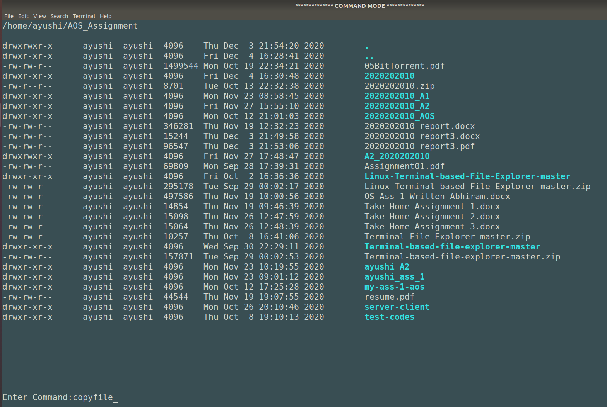

# Linux-Terminal-Based-File-Explorer
## To compile the project :
Use `make` command
## To run the project :
Use `./main` command
## To remove compiled files : 
Use `make clean`

## Snapshot of the project :

